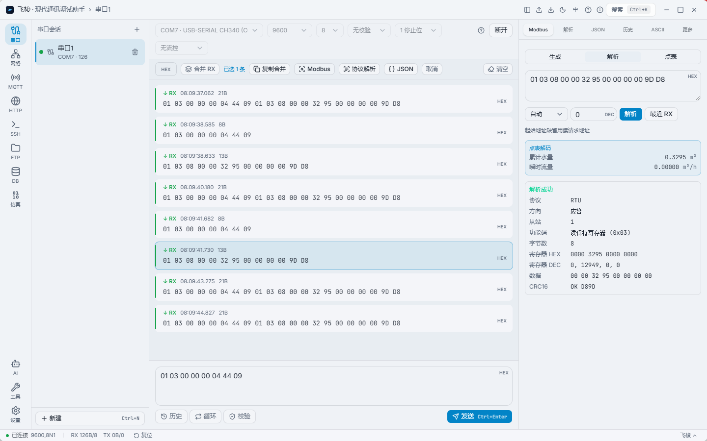
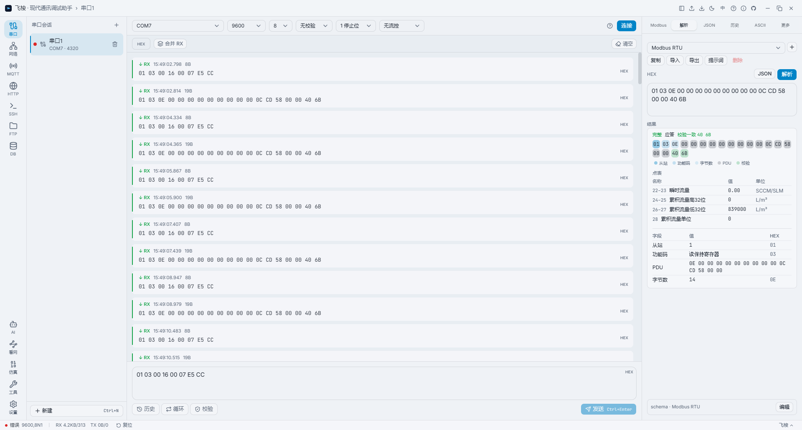
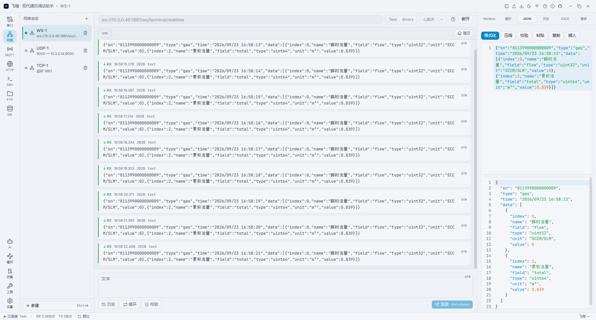
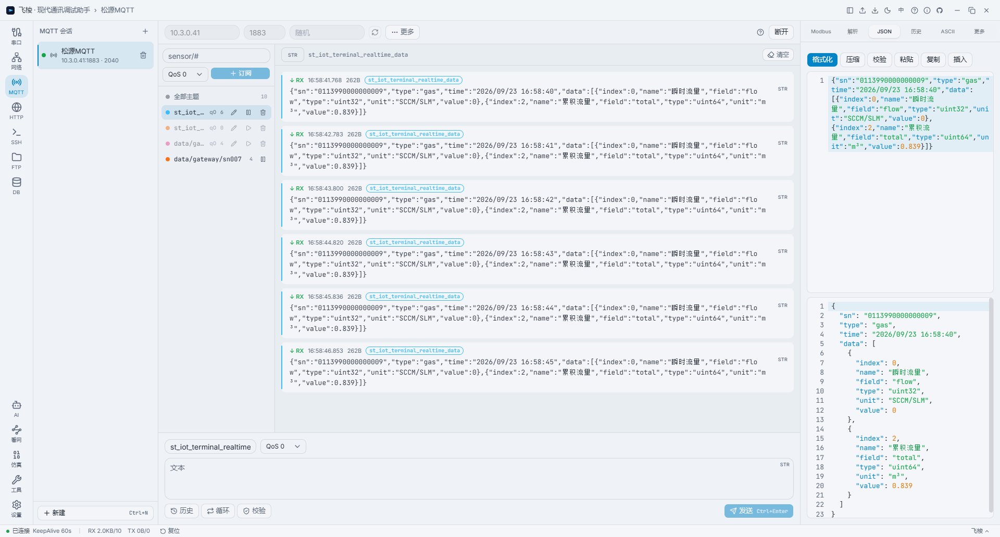
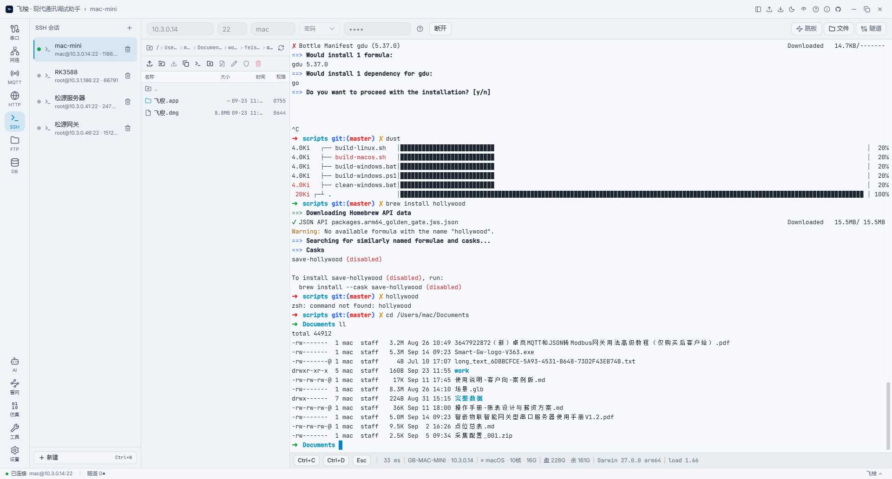
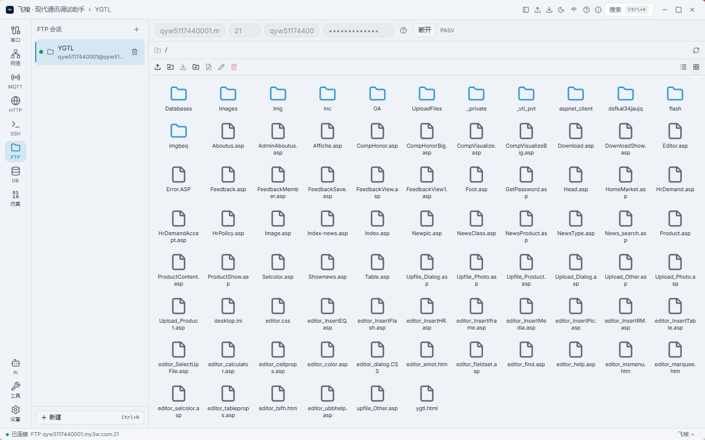
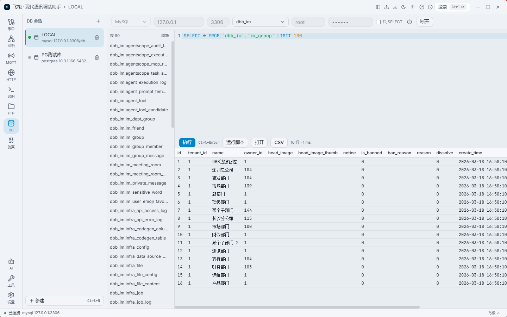
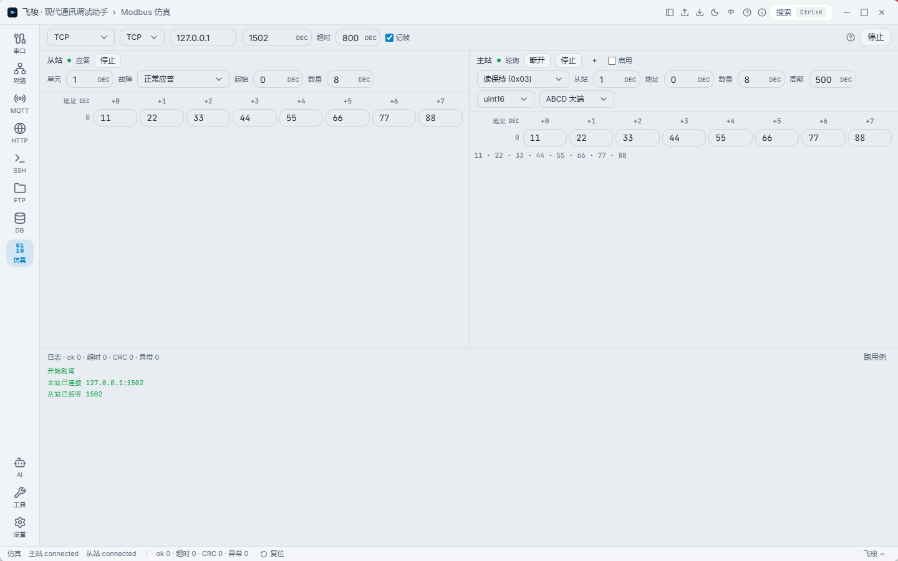
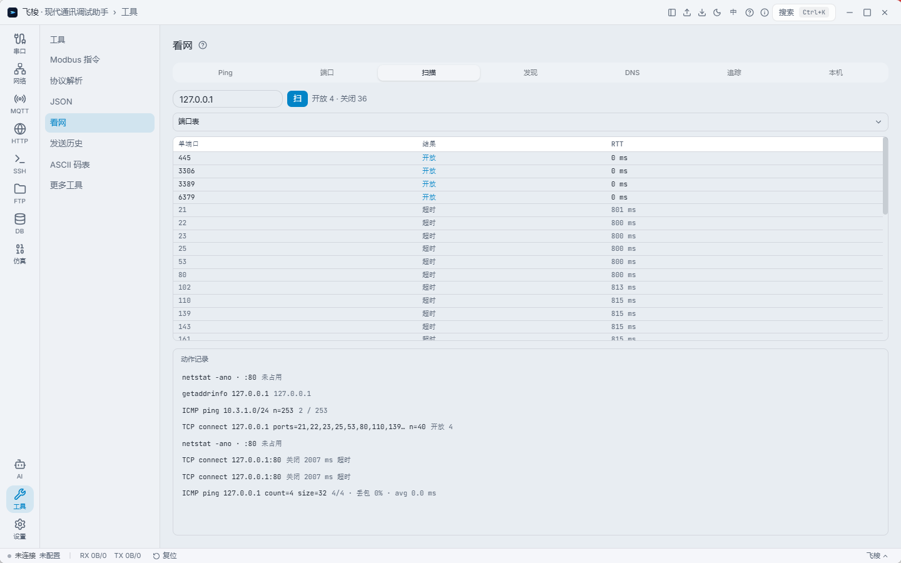

> 关键词 / Keywords：串口调试 serial-port · 网络调试 network-tools · Modbus · MQTT · SSH · 协议解析 protocol-analyzer · 跨平台 cross-platform · Tauri · Rust

# Feisuo

Modern Communication Debugging Toolbox (Feisuo) — A local, offline-first debugging tool for Serial / TCP / UDP / WebSocket / MQTT / HTTP and more.

***

# 🚀 Feisuo

> **A modern, lightweight, and cross-platform communication debugging & development toolbox.**
> Tired of legacy WinForm serial assistants and bloated debugging software? Replace 10 tools on your desktop with this single 20MB app.

[](LICENSE)
[](https://tauri.app)
[](https://www.rust-lang.org)
[](https://vuejs.org)
[](#)

---
## Preface

Feisuo began with a data-acquisition project.

Back then, my desktop was a patchwork of debugging tools: a serial assistant for devices, a network utility for links, an MQTT client for telemetry, an HTTP tool for APIs. Install one, switch to another, copy-paste HEX across three windows. Some were tiny portable greens; others weighed hundreds of megabytes and took ages to launch. One day, mid copy-paste, it hit me: **instead of babysitting a pile of tools, why not fold them into a single toolbox of my own?**

So I built the core four first: Serial, Network, MQTT, HTTP. Using it daily, I noticed the scattered chores of dev and ops—SSH sessions, ad-hoc SQL, network probes, checksum math—were the same kind of friction. So a slice of dev/ops tooling moved into the box.

Feisuo is not a Swiss-army knife that does everything. It just packs the friction I repeat every day into a 20MB shell. If tool fragmentation has worn you down too, may it serve you well.

Notably, a significant portion of Feisuo's codebase was written with deep AI assistance. Throughout this process, I focused on tackling real-world pain points, defining product boundaries, and knowing what not to build; the AI handled the Rust and Vue implementation details. This project is not just a toolbox, but an experiment in deep collaboration between human product intuition and AI coding capabilities. If you are intrigued by this new paradigm of development, feel free to explore the source code and experience the magic of indie-hacking in the AI era.

## 💡 Why Feisuo?

In daily IoT deployment, backend development, hardware integration, and server maintenance, we constantly find ourselves juggling a dozen different tools: NetAssist for serial ports, MQTTX for IoT, Postman for APIs, Xshell for SSH, DBeaver for databases, Wireshark for packet sniffing...

**Feisuo** aims to end this "tool fragmentation." Built on **Tauri 2.x + Rust + Vue 3**, it integrates 7 core communication protocols, an SSH terminal, lightweight database querying, network diagnostics, and protocol parsing into a single **minimalist, modern, and offline-first** desktop application.

**Core Promises**:
- 🪶 **Ultra-Lightweight**: Installer < 20MB, cold start < 2s, idle memory < 200MB.
- 🔒 **Absolute Privacy**: Runs entirely locally; communication session data never leaves your machine.
- 🎨 **Modern Aesthetics**: Say goodbye to gray, heavy borders. Features a dark design language inspired by Linear/Raycast, with a card-based message flow.

---

## ✨ Core Features

### 📡 7 Core Communication Protocols
- **Serial**: Supports hot-plug monitoring, hot-unplug protection, and custom baud rates.
- **TCP / UDP**: Supports TCP Server with multi-client color-coded management, and UDP broadcasting.
- **WebSocket**: Supports Text/Binary modes, heartbeat keep-alive, and custom headers.
- **MQTT**: Full-featured MQTT 5.0 client with wildcard subscriptions, QoS, and TLS.
- **HTTP**: Bypasses browser CORS restrictions; supports environment variables, assertion scripts, and Postman imports.
- **SSH Terminal**: Direct rendering via xterm.js, featuring TOFU (Trust On First Use) fingerprint verification, auto-reconnect, and multi-line paste confirmation to prevent accidental execution.

### 🛠️ Geek Toolbox
- **🧩 Universal Protocol Parser (Schema Engine)**: Ditch the hardcoding! Define frame headers/footers, lengths, checksums, and fields via declarative JSON Schemas to slice, decode, and verify HEX streams in real-time. (Perfect for proprietary and non-standard protocols).
- **🔄 Modbus Simulator Lab**: Built-in Poll (Master) and Slave simulators with memory/TCP loopback support. Test Modbus logic in a closed loop without real hardware.
- **🌐 Network Probe (Network Diagnostics)**: A privilege-free network probe. Ping, single-port testing, LAN device discovery, routing table viewing, and DNS tracing—your "Swiss Army Knife" for server deployment.

### 💻 Modern SSH & SFTP
- **File Drawer**: Seamless SFTP integration supporting drag-and-drop upload/download, recursive deletion, and one-click path copy & `cd`.
- **Jump Host & Tunnels**: Supports `-J` single-hop jump hosts and `-L/-R/-D` port forwarding. Map tunnels to local Feisuo TCP/HTTP sessions with one click.
- **Terminal Search**: `Ctrl+F` to quickly search through 5,000 lines of scrollback history.

### 🗄️ DB Scalpel (Lightweight SQL Executor)
- Designed specifically for on-site troubleshooting, supporting **PostgreSQL / MySQL / SQLite**.
- Features CodeMirror SQL highlighting, quick table listing, script execution, and CSV export.
- **Philosophy of Restraint**: Focuses solely on "querying" and "executing." No heavy ER diagrams or table-building wizards; it does not aim to replace professional IDEs.

### 🤖 AI Model Testing Sandbox
- An isolated OpenAI-compatible API testing page with SSE streaming support.
- **Strict Isolation**: Never reads your communication sessions or code; used purely for testing LLM endpoints.

---

## 🖥️ UI Preview












<!--  -->

---

## 🛠️ Tech Stack

| Layer | Technology |
| :--- | :--- |
| **Shell / Core** | **Tauri 2.x** (Rust-driven for ultimate lightness and security) |
| **Frontend** | **Vue 3** + Vite + Pinia |
| **UI Components** | **Tailwind CSS** + **shadcn-vue** (Modern design language) |
| **Network / Serial** | `tokio` (Async runtime), `serialport`, `tokio-tungstenite`, `rumqttc` |
| **Database** | `sqlx` (Pure Rust async SQL driver) |
| **Terminal Rendering** | `xterm.js` + `xterm-addon-search` |

---

## 🚀 Quick Start

### Download & Install
Head over to the [Releases Page](#) to download the installer for your platform:
- **Windows**: `.msi` or `.exe`
- **macOS**: `.dmg` (Supports both Intel & Apple Silicon)
- **Linux**: `.AppImage` or `.deb`

> **💡 Mac Users**: If you see an "Unidentified Developer" warning on first launch, go to `System Settings -> Privacy & Security` and click "Open Anyway", or run `sudo xattr -rd com.apple.quarantine /Applications/Feisuo.app` in your terminal.
> **🐧 Linux Users**: If serial ports cannot be read, add your current user to the `dialout` group: `sudo usermod -a -G dialout $USER`, then log out and log back in.

### Keyboard First
- `Ctrl/Cmd + K`: Invoke the global command palette (switch sessions, jump to tools, execute conversions).
- `Ctrl/Cmd + Enter`: Send message / Execute SQL.
- `Ctrl/Cmd + F`: Search SSH terminal scrollback history.
- `Ctrl/Cmd + B`: Collapse/Expand sidebar.

---

## 👨‍💻 Local Development

If you want to contribute or compile it yourself, ensure you have [Node.js (v20+)](https://nodejs.org/), [pnpm](https://pnpm.io/), and [Rust](https://www.rust-lang.org/tools/install) installed.

```bash
# 1. Clone the repository
git clone https://github.com/your-username/Feisuo.git
cd Feisuo

# 2. Install frontend dependencies
pnpm install

# 3. Start development mode (Frontend HMR + Rust auto-recompile)
pnpm tauri dev

# 4. Build for production
pnpm tauri build
```

---

## 🚫 Out of Scope

To keep the tool **lightweight and pure**, we have intentionally excluded the following features:
- ❌ **No** data waveforms / oscilloscopes (Please use Serial Studio).
- ❌ **No** heavy database management / ER diagram design (Please use DBeaver / DataGrip).
- ❌ **No** packet sniffing / IP routing modifications (Please use Wireshark / system commands).
- ❌ **No** team collaboration / cloud sync (Your data stays on your machine, forever).

---

## 🤝 Contributing & License

This project is open-sourced under the [MIT License](LICENSE).
Issues for bug reports and Pull Requests for code contributions are highly welcome. Before submitting a major feature PR, please open an Issue for discussion to ensure it aligns with the project's philosophy of "restraint."

---

<p align="center">
  <b>Feisuo</b> - Make every debugging session as swift and precise as a flying shuttle.
</p>